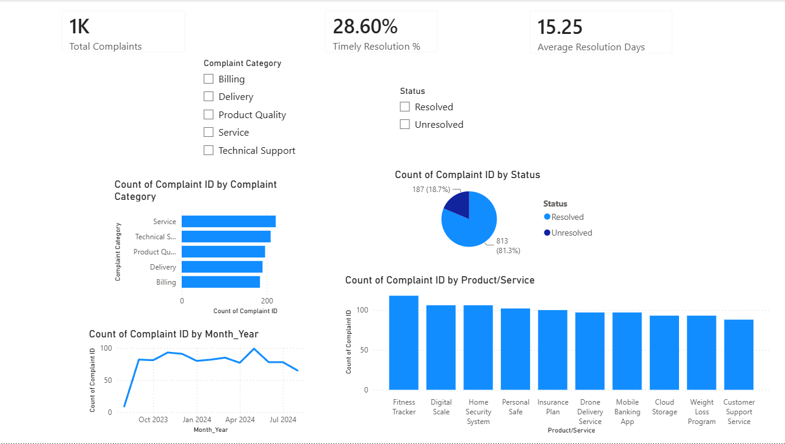

# 📊 Consumer Grievance Analytics System

An end-to-end **Data Analytics** project that analyzes consumer grievance data using **Python**, **Pandas**, **Matplotlib**, and **Power BI** to uncover business insights, generate automated reports, and build an interactive analytics dashboard.

---

## 📌 Project Overview

The **Consumer Grievance Analytics System** helps analyze customer complaints to identify trends, evaluate complaint resolution performance, and support data-driven decision-making.

The project demonstrates the complete data analytics workflow, including:

- Data Cleaning & Preprocessing
- Exploratory Data Analysis (EDA)
- Feature Engineering
- Data Visualization
- Automated PDF Report Generation
- Interactive Power BI Dashboard

**Dataset Size:** 1,000 consumer grievance records

---

## 🚀 Features

- ✅ Clean and preprocess raw complaint data
- ✅ Perform Exploratory Data Analysis (EDA)
- ✅ Generate analytical features
- ✅ Create business visualizations using Matplotlib
- ✅ Automatically generate multi-page PDF reports
- ✅ Build an interactive Power BI dashboard
- ✅ Analyze complaint resolution performance using KPIs

---

## 🛠️ Tech Stack

| Technology | Purpose |
|------------|----------|
| Python | Data Processing |
| Pandas | Data Cleaning & Analysis |
| NumPy | Numerical Computing |
| Matplotlib | Data Visualization |
| Jupyter Notebook | Exploratory Data Analysis |
| Power BI Desktop | Interactive Dashboard |
| Git | Version Control |
| GitHub | Project Hosting |

---

## 📂 Project Structure

```text
Consumer-Grievance-Analytics/
│
├── data/
│   ├── consumer_grievances.csv
│   └── cleaned_consumer_grievances.csv
│
├── notebooks/
│   └── data_preprocessing.ipynb
│
├── reports/
│   └── complaint_analysis_report.pdf
│
├── images/
│   └── dashboard.png
│
├── Consumer-Grievance-Analytics.pbix
├── generate_report.py
├── requirements.txt
├── LICENSE
├── README.md
└── .gitignore
```

---

## 📈 Dashboard KPIs

The Power BI dashboard includes:

- 📌 Total Complaints
- 📌 Timely Resolution Percentage
- 📌 Average Resolution Days

The dashboard also supports interactive filtering using:

- Complaint Category Slicer
- Resolution Status Slicer

---

## 📊 Dashboard Visualizations

The dashboard provides the following interactive visualizations:

- 📊 Complaint Category Analysis
- 📈 Monthly Complaint Trend
- 🥧 Resolution Status Distribution
- 📉 Product/Service Complaint Analysis
- 🎛️ Interactive Complaint Category Filter
- 🎛️ Interactive Resolution Status Filter

---

## 📷 Dashboard Preview

> Replace the image below with your dashboard screenshot.



---

## 📄 Automated PDF Report

The project automatically generates a professional multi-page PDF report containing:

- Top Complaint Categories
- Monthly Complaint Trend
- Resolution Status Distribution
- Product/Service Complaint Analysis

Generated report location:

```text
reports/complaint_analysis_report.pdf
```

---

## 📈 Key Insights

- More than **81%** of complaints were successfully resolved.
- Average complaint resolution time is approximately **15 days**.
- Service-related complaints are the most frequent.
- Complaint volume varies across different months.
- Complaint patterns differ across products and services.

---

## ▶️ Getting Started

### 1️⃣ Clone the Repository

```bash
git clone https://github.com/Aztec331/Consumer-Grievance-Analytics.git
```

### 2️⃣ Navigate to the Project

```bash
cd Consumer-Grievance-Analytics
```

### 3️⃣ Install Dependencies

```bash
pip install -r requirements.txt
```

### 4️⃣ Generate the Automated PDF Report

```bash
python generate_report.py
```

---

## 📚 Skills Demonstrated

- Data Cleaning
- Data Preprocessing
- Feature Engineering
- Exploratory Data Analysis (EDA)
- Data Visualization
- Business Intelligence
- Dashboard Design
- Power BI Development
- Automated Reporting
- Git & GitHub

---

## 🔮 Future Improvements

- SQL Database Integration
- Predictive Analytics using Machine Learning
- Real-Time Complaint Monitoring
- Streamlit Web Dashboard
- Automated Email Reporting

---

## 📄 License

This project is licensed under the **MIT License**.

---

## 👨‍💻 Author

**Aditya Babar**

- GitHub: https://github.com/Aztec331
- LinkedIn: https://www.linkedin.com/in/aditya-babar-7604141a3/

---

⭐ If you found this project useful, consider giving it a star!
